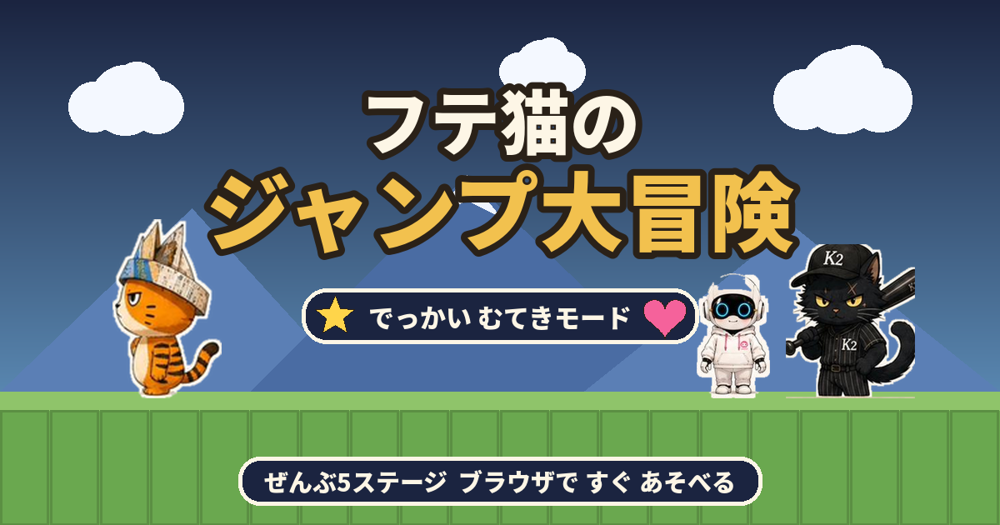

# フテ猫のジャンプ大冒険



クロネコさんが チャッピーちゃんを 山のてっぺんへ つれていった！
フテ猫を そうさして、ぜんぶ5つのステージを こえて たすけだそう。

**▶ あそぶ： https://ganapati0330.github.io/futeneko-jump/**

ブラウザだけで動く横スクロールアクションゲームです。
インストール不要、外部ライブラリなし、ファイル1つで完結します。

---

## あそびかた

### パソコン

| そうさ | キー |
| --- | --- |
| うごく | ← → ／ A D |
| ジャンプ | スペース ／ ↑ ／ W ／ Z |
| ダッシュ | Shift ／ X |
| ポーズ | P ／ Esc |
| 音のオン・オフ | M |

音は **最初にどこかをタップ／キーを押した瞬間**から鳴りはじめます
（ブラウザの自動再生制限のため、ページを開いただけでは鳴りません）。

### スマホ・タブレット

**かならず よこ画面になります。** 端末が たて向きのときは、
自動で 画面を 横向きに 回転して表示します（端末を よこに かたむけてください）。
Android の Chrome などでは、はじめると 全画面＋横向きロックも かかります。

**指でなぞって そうさできます。** ボタンを 正確に おす必要はありません。

| そうさ | 指の うごき |
| --- | --- |
| うごく | 画面の **左半分**を 指で なぞる。指を置いた場所に スティックが出て、なぞった方向へ 歩きます |
| ダッシュ | 左半分で **大きく（54px以上）** なぞる。スティックが ピンク色に なります（ダッシュ用のボタンは ありません） |
| ジャンプ | 画面の **右半分を タップ**。おしっぱなしで 高くとべます |
| ジャンプ（片手） | 左半分で 指を **上へ はらう**。移動しながら ジャンプできます |
| ポーズ | 右上の ⏸ |
| 音のオン・オフ | 右上の 🔊（⏸ の すぐ下） |

ポーズと 音のボタンは **画面の右上**に まとめてあります。
ジャンプボタン（右下）とは 十分に 離してあるので、
ジャンプのつもりで 音を 消してしまうことは ありません。

2本指も つかえます（左指で 移動しながら 右指で ジャンプ）。
したの **◀ ▶ ジャンプ の3つのボタン**でも あそべます。
ダッシュボタンは 置いていません（なぞる操作か、パソコンの Shift をつかってください）。

- てきの **あたま を ふむ** と たおせます。
- ジャンプボタンを **長おしすると 高く** とべます。
- あなに おちる／てきに ぶつかると ライフが 1つ へります。
- **やられても、その場所から いちばん近い 安全な足場で 再スタート**します。
  スタート地点まで もどされません。トゲの上や てきの すぐ横にも 出てきません。
- 各ステージの さいごには **ボスの クロネコさん**が まちかまえています。
  **ボスを たおさないと ゴールできません。**

## アイテム

| | なまえ | こうか |
| --- | --- | --- |
| ⭐ | **スター** | **でっかい むてきモード**（約8秒）。体が大きくなり、てきに ぶつかっても へいき。ふれるだけで てきを たおせて、よこの レンガも たいあたりで こわせます。走る速さと ジャンプ力も すこしアップ。 |
| 💗 | **ハート（1UP）** | **ライフが 1つ ふえる。** ライフは最大9まで。 |
| 🐾 | **コイン** | 100まい あつめるごとに ライフが 1つ ふえます。 |

スターとハートは **肉球ブロック**（新聞紙でつつんだ はこに フテ猫の 肉球マーク）から
出てきます。下から たたくと 中身が とび出します。
どのステージにも スターとハートが かならず1つ以上 入っています。

## ステージ

どのステージも 終わりに **ボス戦の広場**があります。
ボスの クロネコさんを 何回か ふんで たおすと、ゴールの ロックが 外れます。
ボスは ふつうの てきの **4.6倍の大きさ**で、足もとに 赤いオーラ、
頭の上に「ボス」の ふきだしが 出るので すぐ わかります。
近づくと ドンと 音と ゆれで 登場し、画面上に たいりょくバーが 出ます
（それまでは 静かに 待っているので、ステージ開始時に 音や ゆれは 起きません）。

| | ステージ | ボスの たいりょく | とくちょう |
| --- | --- | --- | --- |
| 1 | くさはらを かけぬけろ | 1かい | まずは 走る・とぶ・ふむ の練習 |
| 2 | れんがの まちなみ | 2かい | こわせるレンガと 肉球ブロックがいっぱい |
| 3 | ひんやり どうくつ | 2かい | せまい通路と トゲ。ボスが **ボールを投げてくる** |
| 4 | 山のぼり ちょうせん | 3かい | 上へ上へ！ 縦スクロール。頂上が ボス広場 |
| 5 | 山頂の たたかい | 3かい | いちばん すばやい ボス。ラストバトル |

ステージが 進むほど ボスは たいりょくが 多く、動きも 速くなります。

## でてくるキャラクター

- **フテ猫** — 主人公。新聞かぶとが トレードマーク。
- **チャッピーちゃん** — さらわれた なかま。各ステージのゴールで まってくれています。
- **クロネコさん** — ライバル。ステージ中では ふつうの てきとして、
  各ステージの さいごには **K2ユニフォーム姿のボス** として立ちはだかります。
- その他のてき — カメ（ふむと甲羅になり、けると他のてきをなぎたおす）、イヌ（速くて はねる）、クマ（2かい ふまないと たおせない）、トリ（波をえがいて とぶ）

## 技術メモ

- HTML / CSS / JavaScript のみ。フレームワークなし、ビルド不要。
- 画像は base64 で HTML に埋めこみ済み。**index.html 1ファイルだけで動きます**（オフライン可）。
- BGM・効果音は Web Audio API による **リアルタイム合成**。音声ファイルは1つも使っていません。
  - BGMは全6曲（タイトル＋ステージ5種）。ベース・メロディ・キック・スネア・ハイハットの
    5パートを 8分音符きざみで先読みスケジュールしています。
  - 効果音は12種類（ジャンプ／ふむ／コイン／ブロック／バネ／ダメージ／パワーアップ／
    中間ポイント／ボス／クリア／ゲームオーバー ほか）。
  - スマホで音が出ない問題への対策として、最初のタップで AudioContext を解錠し、
    `navigator.audioSession` を `playback` に設定 ＋ 無音WAVをループ再生することで、
    **iPhone のマナーモード（サイレントスイッチ）でも鳴る**ようにしています。
  - 鳴らせない状態でBGM再生が呼ばれた場合は「保留」しておき、解錠された瞬間に鳴り出します。
    アプリを切り替えて戻ったときも自動で復帰します。
- アイテムの入った箱は、フテ猫の 新聞かぶとに あわせた **肉球ブロック**として
  独自にデザインしています（新聞紙の紙面・おりめ・肉球マーク、たたくと 色あせた紙になる）。
- 描画は Canvas 2D。背景（雲・丘・街なみ・鍾乳洞・雪山・雲海）も すべてコードで描いています。
- 進行状況（クリア済みステージ・ハイスコア）は localStorage に保存します。
- ボスは 足もとの 地続きの床を「広場」として おぼえていて、その外には 出ません。
  穴に 落ちて 倒せなくなることが ないよう、広場のふちで 押しもどし、
  はみ出す方向へは 大きく ジャンプしないようにしています。
- やられたときの 復活地点は、死んだ座標から 全タイルを走査して
  「足もとが地面 ／ 体が入る すきま ／ 上下左右が トゲでない ／ 敵から離れている」
  条件を満たす タイルのうち いちばん近いものを選んでいます
  （横スクロール面では 手前がわを優先し、死んで 穴を こえられないようにしています）。
- スマホが たて向きのときは、ステージ全体を CSS で 90 度回転させて 横画面表示にしています。
  タッチ座標も回転にあわせて変換しているので、回転中でも 指なぞり操作が ずれません。
  あわせて Fullscreen API と Screen Orientation API による 横向きロックも試みます
  （iOS Safari は 未対応のため、CSS 回転のほうで対応します）。
- 全ステージについて、実際のゲームコードを Node.js 上で走らせる自動プレイテスト、
  足場間ジャンプの到達性検証、アイテム挙動テスト、
  タッチ操作・画面回転のテスト（`pointerdown` / `pointermove` の擬似イベントで検証）、
  サウンドのテスト（Web Audio をモックして 音の予約・ミキサー結線・解錠処理を検証）、
  ボス戦とリスポーンのテスト（ゴールのロック・ボスの強さ・安全地点の選び方を検証）を
  通しています。

## ファイル構成

```
futeneko-jump/
├── index.html            ゲーム本体（これ1つで動きます）
├── README.md             この説明
├── LICENSE               MIT（キャラクター画像は対象外）
├── ogp.png               SNS共有用のサムネイル（1200×630）
├── apple-touch-icon.png  ホーム画面に追加したときのアイコン（180×180）
├── .nojekyll             GitHub Pages の Jekyll 処理を無効化
└── .gitignore
```

## 公開のしかた（GitHub Pages）

1. GitHub で `futeneko-jump` という名前のリポジトリを新規作成（Public）
2. このフォルダの中身をすべてアップロードしてコミット
3. リポジトリの **Settings → Pages** を開く
4. Source を **Deploy from a branch**、Branch を **main / (root)** にして Save
5. 1〜2分ほどで `https://ganapati0330.github.io/futeneko-jump/` に公開されます

## ライセンス

- **ソースコード**（`index.html` に含まれる HTML / CSS / JavaScript）: MIT License（[LICENSE](LICENSE) を参照）
- **キャラクターの画像・デザイン**（フテ猫、クロネコさん、チャッピーちゃん、および `ogp.png` / `apple-touch-icon.png` に含まれる図像）: © 泉正道. All rights reserved.
  MIT License の対象外です。転載・二次利用はできません。
